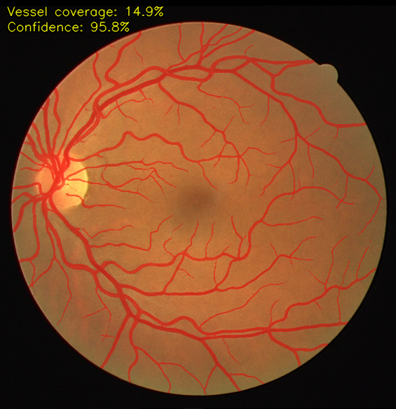
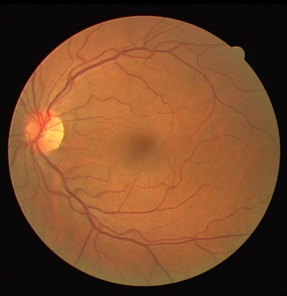

# Retinal Vessel Segmentation (DRIVE) — U-Net + FastAPI

Segment blood vessels in retinal fundus images with a PyTorch U-Net (pretrained
ResNet34 encoder), a 2-channel CLAHE + Frangi input, trained and evaluated on
the **DRIVE** dataset, and served through a FastAPI endpoint that returns the
predicted vessel mask overlaid on the original image — together with a
label-free "goodness" score.



---

## Results

Evaluated on a held-out validation split, **strictly inside the field-of-view
(FOV) mask** (the way published DRIVE results are reported):

| Metric | Scratch U-Net *(default)* | smp + ResNet34 *(`--arch smp_resnet34`)* |
|--------|:--:|:--:|
| **F1 (Dice)** | **0.833** ✅ | 0.821 ✅ |
| Sensitivity | 0.821 | 0.809 |
| Specificity | 0.977 | 0.975 |
| AUC | 0.980 | 0.976 |

Both use the same 2-channel CLAHE+Frangi input and both clear the commonly cited
**> 0.81** DRIVE benchmark. On this small 16-image split the from-scratch U-Net
beat the heavier pretrained model **across every patch size tried** (64/128px)
and trained more stably — so it's the default. Pick the architecture with
`--arch {unet,smp_resnet34}`. See [Notes & findings](#notes--findings).

---

## Method

```
RGB fundus image
   └─ green channel (vessels have highest contrast here)
        └─ CLAHE (cv2.createCLAHE, clipLimit=2.0)        channel 0
        └─ Frangi vesselness (Hessian tubularity filter) channel 1
             └─ U-Net (smp ResNet34 encoder, or from-scratch 4+4 blocks)
                  └─ 1×1 conv → sigmoid → per-pixel vessel probability
```

- **Preprocessing** ([`dataset.py`](dataset.py)): green-channel CLAHE stacked
  with a Frangi vesselness map → **2-channel** input; padded to 608×608
  (divisible by 32 for the ResNet encoder).
- **Model** ([`models.py`](models.py)): `build_model()` selects either a
  `segmentation_models_pytorch` U-Net with an ImageNet-pretrained **ResNet34**
  encoder, or the from-scratch U-Net ([`unet.py`](unet.py)) — `Conv → BN → ReLU`
  ×2 blocks, MaxPool down, transposed-conv up, skip connections, single-channel
  output.
- **Loss** ([`losses.py`](losses.py)): `0.5 · BCE + 0.5 · Dice`. The Dice term
  counteracts the severe class imbalance — vessels are only ~8–13% of pixels.

---

## Training

- **Data:** DRIVE training set (20 annotated images), split 16 train / 4 val.
- **Strategy:** random **64×64 patch** sampling (8000 patches/epoch) whose
  centres lie inside the FOV. Patch training keeps memory tiny — full-image
  training on an 8 GB GPU is both slower (~530 s/epoch) and memory-bound. Inputs
  are cached so the Frangi filter is computed once per image, not every epoch.
- **Optimizer:** Adam + cosine annealing, flip augmentation, best-validation-F1
  checkpoint saved. The pretrained model wants a gentle recipe (**lr 1e-4**,
  peaks by ~epoch 15–20); the scratch model uses lr 1e-3 over 150 epochs.

```bash
# default: from-scratch U-Net (best & most stable here)
python train.py --arch unet --epochs 120 --lr 1e-3 \
                --patch-size 64 --patches-per-epoch 8000 --batch-size 16
# pretrained ResNet34 encoder alternative (gentler recipe)
python train.py --arch smp_resnet34 --epochs 50 --lr 1e-4 \
                --patch-size 64 --patches-per-epoch 8000 --batch-size 16
python evaluate.py --checkpoint checkpoints/model_drive.pth
```

---

## Serving (FastAPI)

```bash
uvicorn app:app --port 8000
```

- Open **http://localhost:8000/** for a browser upload form, or POST an image:

```bash
curl.exe -F "file=@DRIVE/test/images/01_test.tif" \
         http://localhost:8000/segment --output overlay.png
```

- `POST /segment` → overlay PNG (vessels in red) with the scores burned in and
  also returned as `X-Vessel-Coverage-Pct` / `X-Confidence-Pct` headers.
- `POST /segment.json` → just the numeric scores.
- `GET /health` → liveness + device + checkpoint status.

### "Goodness" scores (no ground truth needed)
- **Vessel coverage %** — share of the retina marked as vessel. Healthy fundus
  images sit around 8–13%; far outside that hints at over/under-segmentation.
- **Confidence %** — mean decisiveness `max(p, 1−p)` of the model inside the
  FOV, rescaled so 0.5 → 0% and 1.0 → 100%. High means the model rarely sits on
  the fence. (Typical: ~95%.)

---

## Examples

| Original | Segmentation overlay |
|----------|----------------------|
|  |  |

More overlays in [`examples/`](examples/).

---

## Dataset

**DRIVE — Digital Retinal Images for Vessel Extraction.** This project expects
the Kaggle distribution placed in `DRIVE/`:

```
DRIVE/
├── training/{images, 1st_manual, mask}   # 20 images + vessel labels + FOV
└── test/{images, mask}                    # 20 images + FOV (no public labels)
```

- Kaggle: https://www.kaggle.com/datasets/andrewmvd/drive-digital-retinal-images-for-vessel-extraction
- Original: https://drive.grand-challenge.org/

> Note: the Kaggle DRIVE distribution does **not** include the second-annotator
> (`2nd_manual`) masks, so inter-annotator agreement is not computed here.

---

## Purpose & use case

Retinal vessel morphology is a biomarker for diabetic retinopathy,
hypertension, and other vascular disease. Automated segmentation supports
screening, vessel-density quantification, and as a preprocessing step for
downstream diagnosis. This repo is a compact, reproducible reference
implementation: classical preprocessing + a clean U-Net + a deployable API.

---

## What this project demonstrates

- **Medical image segmentation** end-to-end: preprocessing → model → loss →
  evaluation → deployment.
- **Classical + deep fusion:** CLAHE and a Hessian-based Frangi vesselness prior
  stacked as a 2-channel input.
- **Two interchangeable models:** a from-scratch U-Net *and* a transfer-learning
  U-Net with a pretrained ResNet34 encoder (`segmentation_models_pytorch`).
- **Class-imbalance handling** via a combined BCE+Dice objective.
- **Correct evaluation:** FOV-masked F1/sensitivity/specificity/AUC, matching
  how the literature reports DRIVE.
- **Honest experimentation:** a clear, documented finding that the heavier
  pretrained model did not beat the simpler one on this small dataset.
- **Memory-aware training** (patch sampling + input caching) that fits an 8 GB
  consumer GPU.
- **Productionization:** a FastAPI service with a browser UI, JSON scores, and
  self-describing overlays.

See [`IMPROVEMENTS.md`](IMPROVEMENTS.md) for opt-in OpenCV / Hugging Face upgrade
paths.

---

## Repository layout

| File | Role |
|------|------|
| [`dataset.py`](dataset.py) | DRIVE loading, CLAHE + Frangi, patch sampling, splits |
| [`models.py`](models.py) | `build_model()` — smp ResNet34 or scratch U-Net |
| [`unet.py`](unet.py) | From-scratch U-Net architecture |
| [`losses.py`](losses.py) | BCE+Dice loss, segmentation metrics |
| [`train.py`](train.py) | Training loop (patch-based, GPU-aware) |
| [`evaluate.py`](evaluate.py) | FOV-masked F1 / Se / Sp / AUC |
| [`app.py`](app.py) | FastAPI service + overlay + scores |
| [`IMPROVEMENTS.md`](IMPROVEMENTS.md) | Optional upgrade paths |

---

## Notes & findings

- **Pretrained ≠ automatically better.** On this 16-image split the heavier
  smp + ResNet34 model underperformed the from-scratch U-Net (0.833) at **every
  patch size tried**: 64px → 0.821 (then overfit-collapses), 128px → 0.817
  (stable but lower). Larger patches gave the deep encoder a bigger bottleneck
  and fixed the instability, but didn't close the accuracy gap. The simpler
  model wins here — pretrained ImageNet features and a deeper net don't help on
  16 domain-specific images, and the bigger net overfits faster.
- **Best-checkpoint saving matters:** because the pretrained model degrades after
  its peak, training always keeps the best-validation-F1 snapshot.
- **Reproducibility caveat:** the val split is only 4 images, so expect ±a few
  points of variance between runs.

## Install

```bash
pip install -r requirements.txt
# GPU (Blackwell/RTX 50-series needs CUDA 12.8 wheels):
pip install torch torchvision --index-url https://download.pytorch.org/whl/cu128
```

## License

MIT — see [`LICENSE`](LICENSE).
