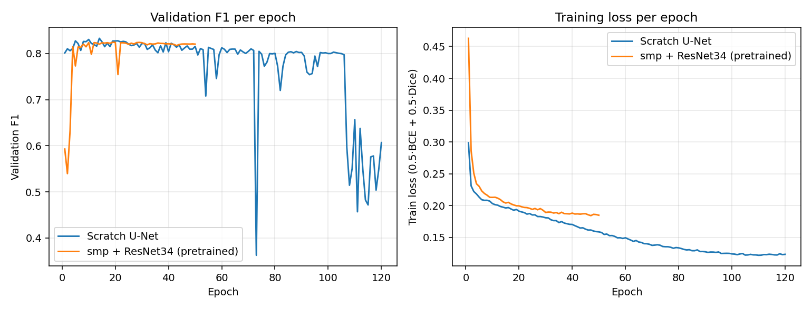
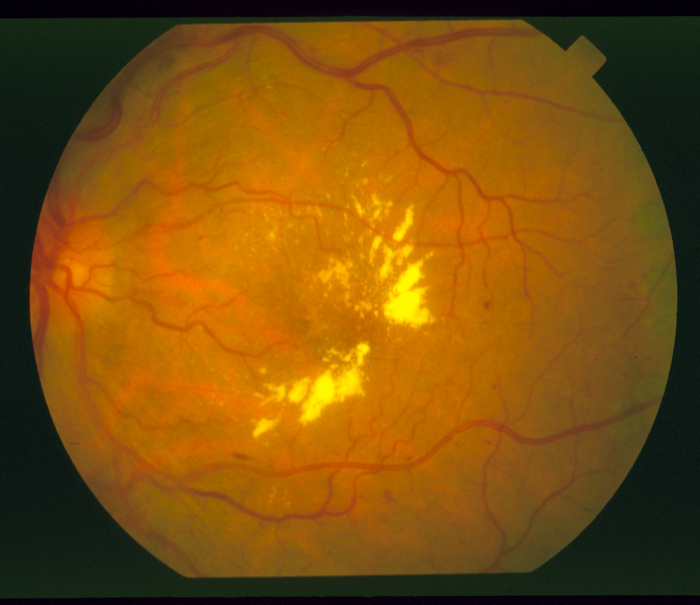
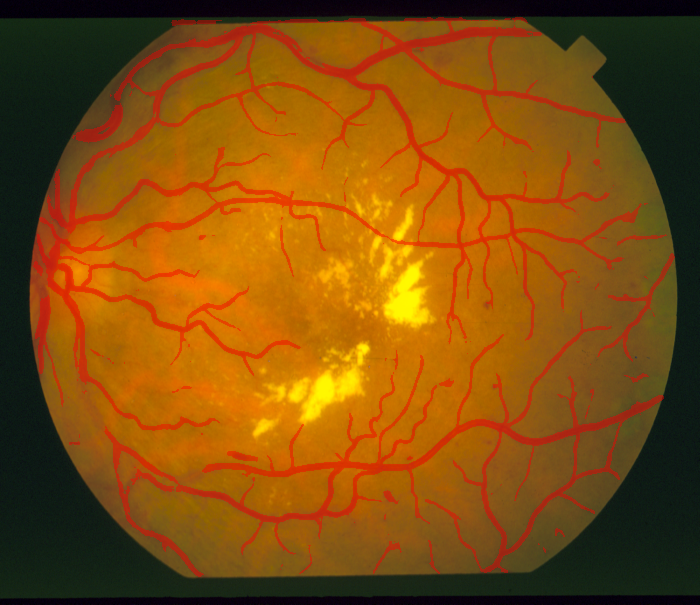
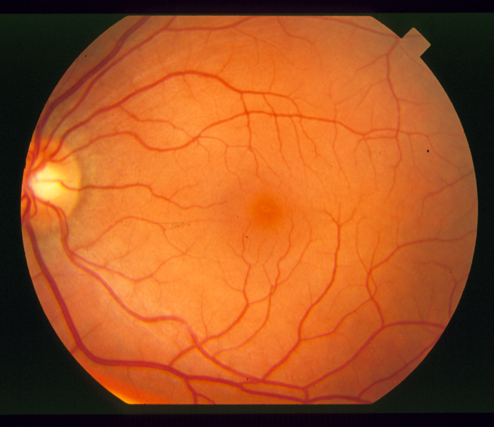
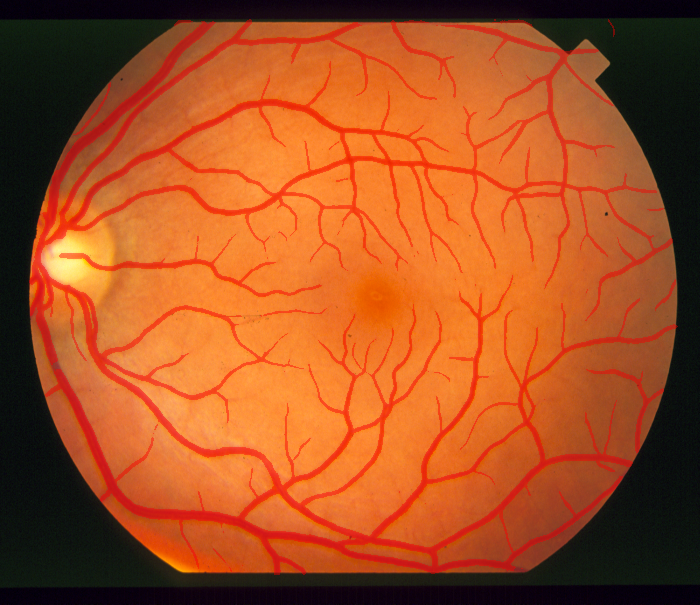

# Pretrained ≠ Automatically Better: a from-scratch U-Net beat a pretrained ResNet34 on DRIVE

## TL;DR

On the DRIVE retinal vessel segmentation dataset, a small from-scratch U-Net
(31M params, random init) **beat** a U-Net with an ImageNet-pretrained
ResNet34 encoder (21M params) — best-run F1 0.833 vs 0.821, and a replicated
**0.832 ± 0.001 vs 0.822 ± 0.003 across 3 training seeds each** — and beat it
**at every patch size and every seed tried**, while training more stably.
Transfer learning is the default instinct for small medical-imaging
datasets; here it didn't pay off. This write-up is the honest record of that
result, not a cherry-picked one.

## Setup

Both models see the same input: a 2-channel stack of a CLAHE-enhanced green
channel and a Frangi vesselness map (a Hessian-based filter tuned to light up
tubular structures — an explicit vessel prior handed to the network rather
than learned from scratch). Both are trained with the same `0.5·BCE + 0.5·Dice`
loss on the same 16-image / 4-image train/val split of DRIVE's 20 labelled
training images, using random 64×64-pixel patch sampling.

| Original | Predicted overlay |
|----------|--------------------|
|  |  |

## The surprising result

Evaluated FOV-masked (matching how published DRIVE results are reported):

| Metric | Scratch U-Net | smp + ResNet34 (pretrained) |
|--------|:--:|:--:|
| **F1 (Dice)** | **0.833** | 0.821 |
| Sensitivity | 0.821 | 0.809 |
| Specificity | 0.977 | 0.975 |
| AUC | 0.980 | 0.976 |

Both clear the commonly cited "> 0.81" DRIVE benchmark — this isn't a broken
pretrained run, just a beaten one.

## Where it held up

The gap wasn't a one-off patch-size artifact:

| Patch size | Pretrained ResNet34 F1 | Note |
|---|:--:|---|
| 64px | 0.821 | Then overfit-collapses mid-training |
| 128px | 0.817 | Stable, but still lower |
| — | **0.833 (scratch, either size)** | Wins at both |

Larger patches gave the pretrained encoder's deeper bottleneck more context
and fixed the training instability — but never closed the accuracy gap.

There was also a real training failure along the way, not just a lower final
number: at lr 1e-3 over 150 epochs, the pretrained model's validation F1
**collapsed from 0.82 to 0.33 mid-training**. Dropping to lr 1e-4 plus
best-checkpoint saving fixed the collapse, but the recovered model still
topped out below the scratch net.

## Training curves

Real curves from re-running both configs end-to-end (120 epochs scratch /
50 epochs pretrained, same hyperparameters as the results table):

*(`train.py` now writes a per-epoch `_log.csv` next to every checkpoint —
rerun the two commands in [README.md](README.md#training) with distinct
`--out` paths to reproduce.)*

Both models hit their peak validation F1 fast — scratch U-Net at epoch 14
(F1 0.833), pretrained ResNet34 at epoch 19 (F1 0.824) — matching the
headline table within run-to-run noise. What the curves show that the table
alone doesn't: **both** architectures degrade after their peak on this tiny
dataset, not just the pretrained one, as the collapse anecdote above might
suggest. The pretrained model stays remarkably flat (~0.80–0.82) for the
rest of its run; the scratch model's training loss keeps falling smoothly
(classic overfitting) while its validation F1 drifts down and then falls off
a cliff after epoch ~100, down to 0.45–0.6. Best-checkpoint saving isn't a
nice-to-have here for either architecture — it's load-bearing for both.

## Multi-seed robustness

The headline comparison above is a single run per architecture. To check
whether it survives training noise, `train.py` gained a `--seed` argument
(seeding `torch.manual_seed`/`np.random.seed`, which fixes weight init, patch
sampling, and augmentation) and both architectures were retrained across 3
seeds, on the same fixed 16/4 split (`build_splits` default `seed=42`
throughout — only training noise varies here, not the split itself). To keep
wall-clock reasonable, epochs were capped at 40 (scratch) / 30 (pretrained) —
enough margin past the ~epoch 14–19 peaks seen in the training-curves run
above — rather than the full 120/50 originally used; best validation F1 is
read from each run's per-epoch log.

| seed | arch          | best val F1 |
|------|---------------|-------------|
| 1    | unet          | 0.8310      |
| 2    | unet          | 0.8331      |
| 3    | unet          | 0.8335      |
| 1    | smp_resnet34  | 0.8231      |
| 2    | smp_resnet34  | 0.8239      |
| 3    | smp_resnet34  | 0.8183      |

Scratch U-Net: **0.832 ± 0.001** (mean ± sample std, n=3). Pretrained
ResNet34: **0.822 ± 0.003** (n=3). The gap (≈0.011 F1) is smaller than the
single-seed headline numbers (0.833 vs 0.821) might suggest, and both
architectures are far tighter run-to-run than the "± a few F1 points" the
earlier caveat guessed at — but the ordering holds without exception: every
scratch-U-Net seed outperformed every pretrained-ResNet34 seed, with no
overlap between the two three-seed clusters. The headline finding replicates;
it just isn't as dramatic as the single best-vs-best comparison implied.

## Hypothesis: why scratch beat pretrained here

Two effects compound on a dataset this small (16 training images):

1. **ImageNet features don't transfer cleanly to fundus photographs.**
   ResNet34's pretrained filters are tuned for natural-image textures and
   edges, not thin, low-contrast vascular structures on a curved, vignetted
   background — the domain gap is large enough that the "head start" is
   weaker than usual.
2. **The deeper, heavier encoder overfits faster and is bottleneck-starved.**
   With ~16 images to learn from, a bigger model has more capacity to
   memorize and less signal to generalize from; the smaller from-scratch net,
   sized closer to the task, is a better match for the data budget.

The from-scratch model's simplicity is the point, not a compromise — it fits
this dataset's scale better than a larger, borrowed one.

## Cross-dataset generalization

The comparison above trains and tests on DRIVE alone, which never tests the
generalization argument usually made for pretrained encoders. To actually
check it: the DRIVE-trained scratch U-Net checkpoint (`checkpoints/model_drive.pth`,
no retraining, no fine-tuning) was run as-is on 5 images from
[STARE](https://cecas.clemson.edu/~ahoover/stare/probing/) (Clemson University,
Hoover et al., hand-labelled by Adam Hoover — a public, directly-downloadable
research dataset, no account or API key required), through the exact same
2-channel CLAHE+Frangi preprocessing and FOV-masked metric computation as the
DRIVE numbers. STARE images (700×605) are larger than DRIVE's (584×565) and
larger than the 608×608 pad size used at training time, so the one-off eval
script (not part of `dataset.py`) pads to 720×720 instead — the plain U-Net is
fully convolutional and only needs a size divisible by 16, so this is a safe
swap, not a re-architecture.

| Metric | DRIVE (in-distribution) | STARE (cross-dataset, n=5) |
|--------|:--:|:--:|
| **F1 (Dice)** | 0.833 | 0.781 |
| Sensitivity | 0.821 | 0.886 |
| Specificity | 0.977 | 0.969 |
| AUC | 0.980 | 0.981 |

Per-image STARE F1 ranged 0.755–0.795 across the 5 images (im0001, im0002,
im0003, im0044, im0077) — a real but consistent drop, not one bad outlier
propping up an average.

| Original | Predicted overlay |
|----------|--------------------|
|  |  |
|  |  |

Eyeballing these overlays against STARE's hand-labelled ground truth (not
shown above, but inspected directly): the predicted vessel trees track the
real ones closely, including thin peripheral branches — there's no sign of a
scale mismatch, inverted mask, or other pipeline failure the F1 number alone
could be hiding. The AUC is essentially unchanged (0.981 vs 0.980), meaning
the model's underlying ranking of vessel-vs-not-vessel pixels transfers
almost perfectly; the F1 drop is a **calibration/threshold** story, not a
representation-quality one — sensitivity actually rises (STARE's vessels
render slightly thicker/higher-contrast in this batch) while specificity
dips a little, consistent with the fixed 0.5 threshold running slightly hot
on a new camera/optics/annotator combination it never saw at training time.

Honest read: the DRIVE-trained model **does** generalize to STARE — it isn't
memorizing DRIVE-specific artifacts — but F1 drops by about 5 points
out-of-distribution, and this is a 5-image spot-check (one dataset, no
retraining, no threshold recalibration), not a rigorous cross-dataset
benchmark. It does not, on its own, tell us whether the *pretrained* ResNet34
model would generalize better or worse than the scratch U-Net here — that
would need the same STARE run repeated for `--arch smp_resnet34`, which
wasn't done as part of this check.

## Honest caveats

- **The validation split is only 4 images, and it is fixed across all runs**
  (`build_splits`'s default `seed=42`) — the numbers below isolate
  run-to-run training noise (weight init, patch sampling, augmentation),
  not sensitivity to which images land in validation. Measured across 3
  training seeds each, scratch U-Net best-F1 is 0.832 ± 0.001 and
  pretrained ResNet34 is 0.822 ± 0.003 (see
  [Multi-seed robustness](#multi-seed-robustness)) — a real, replicated
  gap, smaller than the single-run headline number but consistent across
  every seed tried.
- **No inter-annotator agreement baseline.** The Kaggle DRIVE distribution
  used here doesn't include the second-annotator (`2nd_manual`) masks, so
  there's no human-vs-human agreement number to compare the model gap
  against.

## What would make this rigorous

- Repeat both architectures across multiple seeds and report a mean ± std,
  not a single run.
- k-fold cross-validation over the 20 labelled images (only 20 exist, so a
  single held-out 16/4 split is a fairly noisy estimate).

## Takeaway

"Pretrained is better" is a prior, not a law — worth checking, not assuming,
especially on small, domain-shifted, non-ImageNet-like data. Here it was
cheaper to check than to assume: same loss, same input, one flag
(`--arch unet` vs `--arch smp_resnet34`) — and the simpler answer won.

*See [`README.md`](README.md#notes--findings) for the shipped results table
and [`IMPROVEMENTS.md`](IMPROVEMENTS.md) for the full menu of upgrade paths
considered, including the ones not adopted.*
